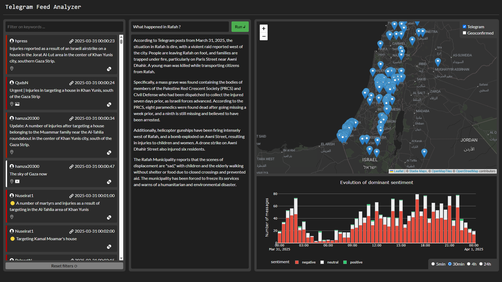

# Telegram Feed Analyzer

<p align="center">
    <br>Some cases where journalists face difficulties accessing the field: war,  natural disasters or military restrictions.
</p>

<p align="center">
    
    <a href="https://www.youtube.com/watch?v=oqyiQ377ngA">YouTube Video</a>
    
    <a href="https://www.kaggle.com/code/guepardow/telegram-feed-analyzer">Kaggle Notebook</a>
    
    <a href="https://mehdimiah.com/blog/telegram_feed_analyzer">Blog post</a>
</p>

This project enhances Telegram feeds, using the Gemini AI API, by adding the following capabilities:
- 🗺️ translation to English
- 📍 geolocation
- 😳 sentiment analysis
- ✉️ similar message search
- ❓ retrieval-augmented generation (RAG)

📆 **News**:
- *20-04-2024: this project was developed for the Kaggle competition [5-day Gen AI Intensive Course with Google](https://www.kaggle.com/competitions/gen-ai-intensive-course-capstone-2025q1).*

# Installation

Main technology used: 
<a href="https://www.python.org/"></a>
<a href="https://aistudio.google.com/app/apikey">
</a>
<a href="https://docs.trychroma.com/docs/overview/introduction">
</a>
<a href="https://dash.plotly.com/">
</a>
<a href="https://react.dev/">
</a>

## Setup
This project uses `uv` as a project manager; you can [download it here](https://docs.astral.sh/uv/).

```sh
git clone https://github.com/Guepardow/telegram_feed_analyzer
cd telegram_feed_analyzer
uv sync  # (or if you use pip: pip install -r requirements.txt)
# If you are not using uv, you need to adapt some lines of code below
```

## Authentification

You must get a [Google API key here (for free)](https://aistudio.google.com/app/apikey). Then, update the file `config.yaml` with this key.

[Optional] You can get a [Telethon API key here (for free)](https://docs.telethon.dev/en/stable/basic/signing-in.html). Then, update the file `config.yaml` with this key.

# Data

You can download 1987 "enhanced messages" posted on Telegram on March 31st, 2025 about the situation in Israel and Palestine:

```sh
curl -q https://mehdimiah.com/blog/telegram_feed_analyzer/data/data_telegram_250331.json --output data/data_telegram_250331.json
```

# Dash Dashboard

First, create Persistent Chroma databases for the embeddings (for the tasks on semantic search and retrieval). The databases will be stored in `./data/.chroma`):
```sh
cd src
uv run similarity_search.py  # build the Chroma database with the embeddings on semantic search
uv run rag.py  # build the Chroma database with the embeddings for the RAG system
```

You can then run a local Dash dashboard by running:

```sh
# terminal 1 to run the database server with the embeddings on semantic search as a HttpClient: 
uv run chroma run --path ./data/.chroma/similarity_search_db --host localhost --port 8000

# terminal 2 to run the database server with the embeddings on retrieval (RAG) as a HttpClient: 
uv run chroma run --path ./data/.chroma/rag_db --host localhost --port 8001

# terminal 3 to run the Dash dashboard: 
uv run app.py
```

<details>
  <summary>Dashboard</summary>

  You should get a Dash dashboard that looks like this illustration: 
    <p align="center">
        
    </p>

  On this dashboard, you can : 
  - read Telegram message translated in English;
  - filter based on a username;
  - open Telegram on a specific message;
  - search for similar Telegram message;
  - locate on a map a coarsely geolocated Telegram message;
  - ask questions to a RAG system built on the Telegram database;
  - visualize the evolution of the sentiment and volume of messages
  
</details>

# Analysis tools

This project aims to provide some analysis tools directly on Telegram messages. You may need a Telegram account and get access to Telethon to run some of the following codes.

## Multi-lingual translation, geolocation and sentiment analysis

With Gemini 2.0 Flash, run the analysis on a single post:
```bash
cd src ; uv run get_analysis.py --method gemini --post https://t.me/<account_name>/<message_id>
```

<details>
  <summary>Example</summary>
  
 ```sh
 uv run get_analysis.py --method gemini --post https://t.me/hamza20300/336071

 # Outputs:

 # Original text: #عاجل
 # 6 إصابات جرّاء إلقاء طائرة مسيّرة إسرائيلية "كواد كوبتر" قنبلة صوب الأهالي في شارع عوني ظهير بمدينة رفح جنوبي قطاع غزة
 # {'translation': '#Urgent 6 injuries as a result of an Israeli drone, "quadcopter", throwing a bomb towards the people in Awni Dhahir Street in the city of Rafah, southern Gaza Strip', 'geolocations': [{'location_name': 'Rafah', 'latitude': 31.294, 'longitude': 34.248}], 'sentiment': {'negative': 0.8, 'neutral': 0.2, 'positive': 0.0}}
 ```
  
</details>

## Similar message search

With Gemini 2.0 Flash:
```bash
cd src ; uv run similarity_search.py  # if not already, build the Chroma database with the embeddings
uv run chroma run --path ../data/.chroma/similarity_search_db --host localhost --port 8000  # terminal 1
uv run similarity_search.py --query "A huge explosion was heard in Rafah" # terminal 2
```

<details>
  <summary>Example</summary>
  
 ```sh
 uv run similarity_search.py --query "A huge explosion was heard in Rafah"

 # Outputs:

# Distance: 0.128 [Date: 2025-03-31 23:52:43] The latest explosion in the city of Rafah was heard throughout the Gaza Strip.
# Distance: 0.133 [Date: 2025-03-31 19:33:56] Again, violent explosions north of the city of Rafah.
# Distance: 0.140 [Date: 2025-03-31 19:36:55] Strong explosions are heard between the city of Khan Yunis and Rafah
# Distance: 0.151 [Date: 2025-03-31 02:20:07] Urgent: New explosion in the Tel Sultan neighborhood of Rafah
# Distance: 0.153 [Date: 2025-03-31 02:24:42] Blowing up a residential square in Al-Sultan neighborhood, west of Rafah, and the sound of its explosion was heard from the central governorate.
 ```
</details>

## Retrieval-Augmented Generation (RAG)

With Gemini 2.0 Flash:
```bash
cd src ; uv run rag.py  # if not already, build the Chroma database with the embeddings
uv run chroma run --path ../data/.chroma/rag_db --host localhost --port 8001  # terminal 1
uv run rag.py --query "What happened in Rafah?"  # terminal 2
```

<details>
  <summary>Example</summary>
  
 ```sh
uv run rag.py --query "What happened in Rafah?"

 # Outputs:

# According to Telegram posts from March 31, 2025, Rafah is experiencing a dire humanitarian crisis.

# Reports indicate that Israeli forces advanced on Rafah approximately seven days prior, resulting in the deaths of Palestinian Red Crescent Society (PRCS) and Civil Defense first responders. According to Eyeonpalestine2, ten PRCS and six Civil Defense first responders were dispatched to collect the injured, but all five ambulances and one fire truck were struck, along with a UN vehicle that arrived later. Contact was lost with all. One survivor reported that Israeli forces killed both of the crew in his ambulance. OCHA org coordinated to reach the site, but access was only granted five days later. While traveling to the area, they encountered civilians fleeing under gunfire and witnessed a woman shot in the back of the head.

# MohnadQ reports that families are leaving Rafah on foot, and QudsN and PalpostN note that the scenes of displacement are heartbreaking, with children and the elderly walking under the scorching sun without shelter or food due to the closure of crossings and the prevention of aid. The Rafah Municipality has been forced to freeze its services due to the harsh conditions, warning of a looming humanitarian and environmental catastrophe. They hold the occupation fully responsible for these crimes and condemn the international silence.

# Additionally, there are reports of violent raids west of Rafah, intense gunfire from helicopter gunships, and explosions in the city. Injured children and women have been transported from Awni Street after a bomb exploded. Hamza20300 reports that families are trapped under fire on Paris Street and are asking to be evacuated due to heavy bombing. MohnadQ reports that a young man was killed and his brother injured while transporting citizens from Rafah.

# QudsN reports that the Palestinian Red Crescent found the bodies of eight paramedics who went missing a week ago after being subjected to heavy gunfire in Rafah. The ninth paramedic is still missing and is believed to have been arrested.
 ```
</details>
