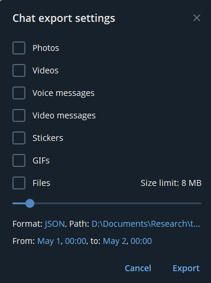

# Data

The `data` folder is organized into two main subfolders: `datamaps` and `geoconfirmed`. This documentation provides an overview of the structure and contents of these subfolders.

## Datamaps Folder

The `datamaps` folder stores all information related to Telegram posts. Each `datamap` contains multiple subfolders, where raw Telegram posts and their enhanced versions are stored for specific time periods.

### Structure

```plaintext
datamaps
├── syria_241125-241215          // a datamap with posts about Syria between Nov 24th and Dec 15
│   ├── datamap-config.yaml      // the configuration of this datamap
│   ├── telegram_baseline.yaml   // all the Telegram posts enhanced with the baseline method
│   ├── telegram_gemini.yaml     // all the Telegram posts enhanced with Gemini AI
│   ├── account1                 // all the Telegram posts from the user account1
│   │   ├── result.json          // raw posts downloaded using the Telegram App
│   │   ├── baseline.json        // Telegram posts enhanced with the baseline method
│   │   └── gemini.json          // Telegram posts enhanced with Gemini AI
│   └──  ...
└── ...
```

### datamap-config.yaml

The `datamap-config.yaml` file describes the datamap and includes the following information:

```yaml
name: 'name_of_the_datamap'

date:
  timezone: 'timezone of the messages -- see https://en.wikipedia.org/wiki/List_of_tz_database_time_zones'
  start: 'Start date for the collect of messages in the format YYYY-MM-DD HH:MM:SS'  # included
  end : 'End date for the collect of messages in the format YYYY-MM-DD HH:MM:SS'  # excluded

map:
  lat: 36 # numerical value to specify the default latitude of the map
  lon: 36 # numerical value to specify the default longitude of the map
  zoom: 8 # numerical value to specify the default zoom of the map
  region: 'Middle East'  # name of the region -- this is used by Gemini AI during the geolocation
  languages: 'Arabic, Hebrew or English'  # all the languages -- this is used by Gemini AI during the translation 

geoconfirmed:  # list of the Geoconfirmed maps' names
 - 'Israel'
 - 'Syria'

telegram:  # list of the Telegram channels
  - 'account_1'
  - 'account_2'
  - 'account_3'
```

## Geoconfirmed Folder

The `geoconfirmed` folder contains raw KMZ files from Geoconfirmed. These files can be updated using the following command:

```sh
cd geoconfirmed
uv run download.py --map <map>
```

The available maps are : 'World', 'INDPAK', 'DRC', 'Sahel', 'Taiwan', 'Cartel', 'Ukraine', 'Israel', 'Syria', 'NagornoKarabakh', 'Yemen', 'Myanmar' and 'WWII'.

## Workflow

### Step 1: Download raw Telegram posts for one account

For a given datamap, create a `datamap-config.yaml`. This is only used for documentation and by the Dash dashboard.
For each Telegram account, create a folder with the same username, and manually download its posts : 

1. On the Telegram application, select an account. Click on the vertical three points on the top-right corner.
2. Click on "Export chat history" (see image on the left)
3. Unselect photos, select format "JSON", the path and the date range and click on Export (see image on the right).
   
<p align="center">
    
    
</p>

### Step 2: Enhance raw Telegram posts for one account

Augment each Telegram posts with translation, geolocation and sentiment analysis.

For the baseline method, run:
```sh
cd ../src/baseline ; uv run raw_to_enhanced.py --datamap <datamap> --account <account>
```

For the Gemini AI method, run:
```sh
cd ../src/gemini ; uv run raw_to_enhanced.py --datamap <datamap> --account <account>
```

### Step 3: Concatenate all enhanced Telegram posts from multiple accounts

Concatenate all Telegram posts from multiple accounts into a single JSON file.

For the method method, to create the file `telegram_baseline.json`, run:
```sh
cd ../src/data_telegram ; uv run create_datamap.py --datamap <datamap> --method baseline
```

For the Gemini AI method, to create the file `telegram_gemini.json`, run:
```sh
cd ../src/data_telegram ; uv run create_datamap.py --datamap <datamap> --method gemini
```